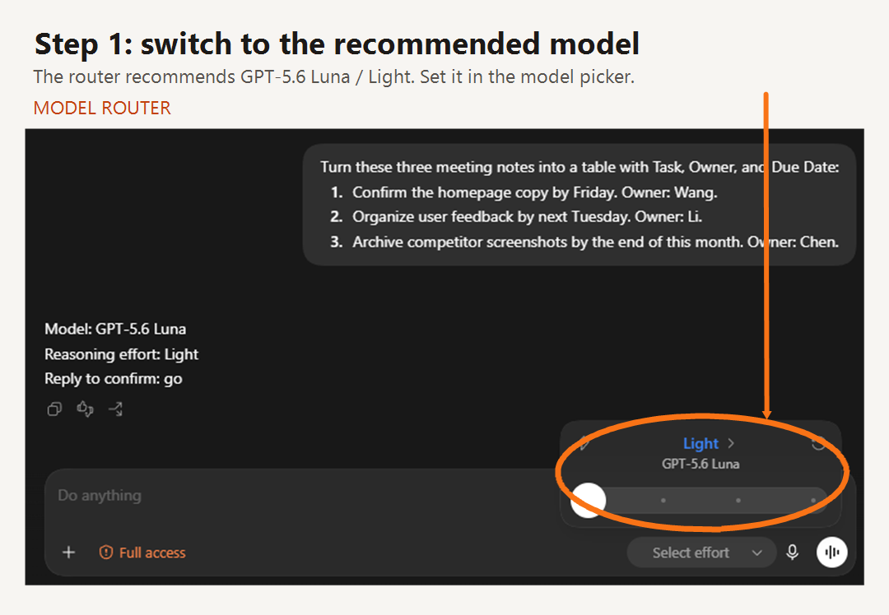
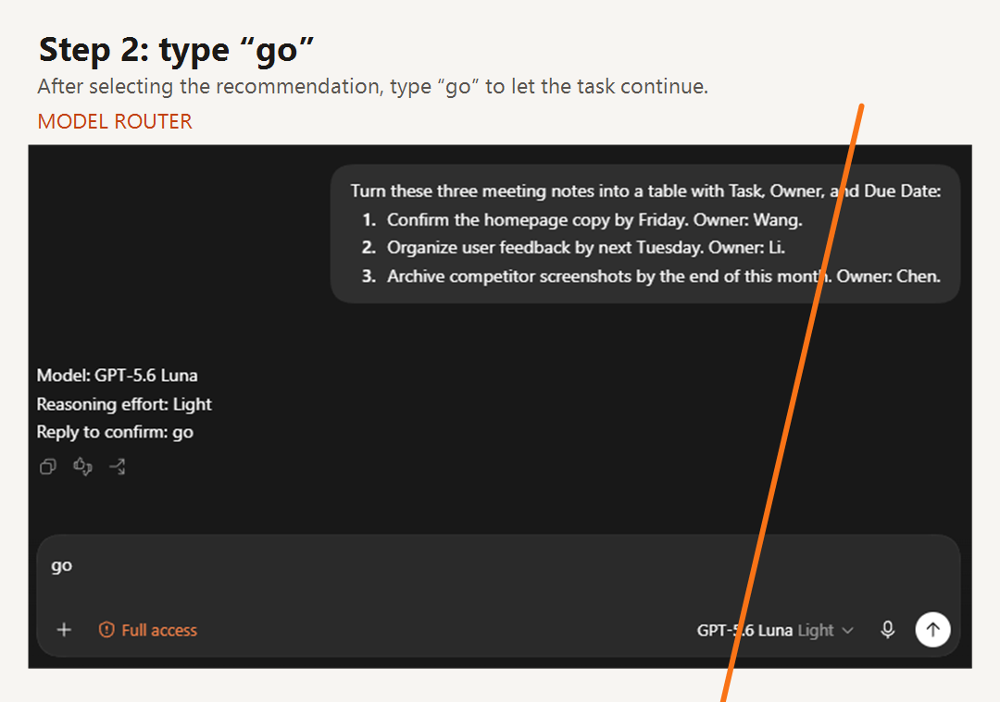
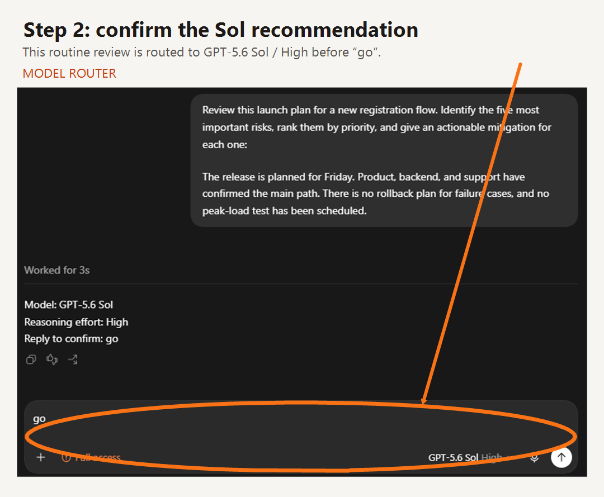
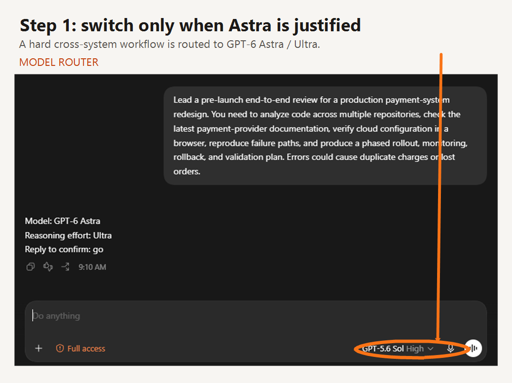
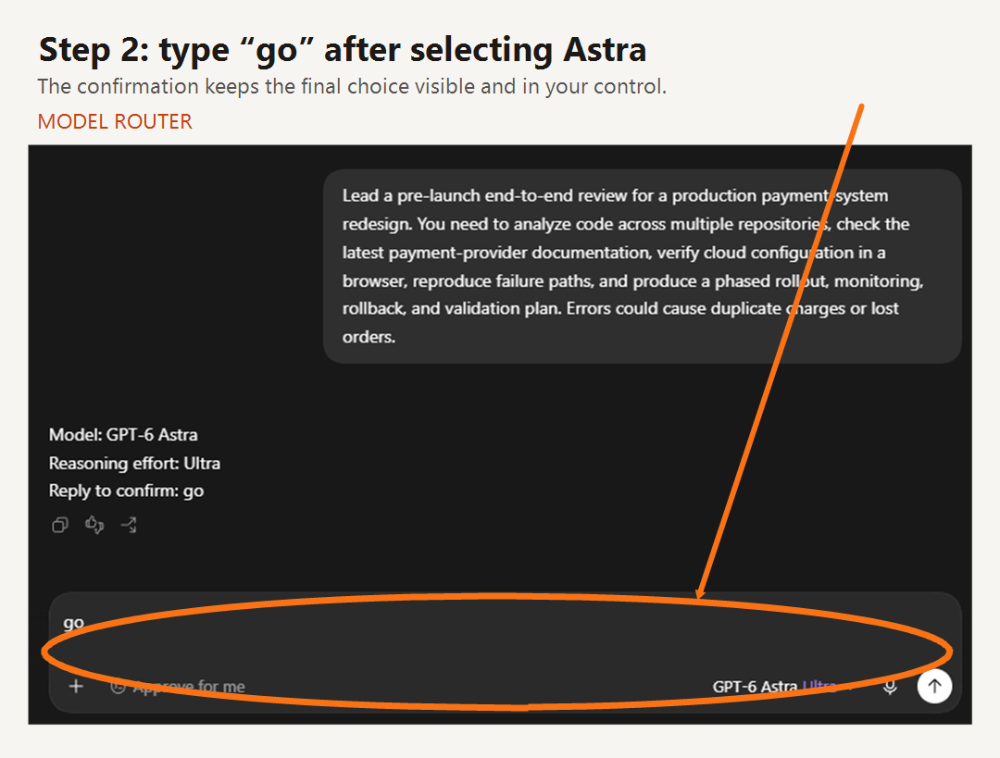

# Save Codex tokens with better model choices

**English** | [Chinese documentation](README.zh-CN.md)

[](LICENSE) [](SKILL.md) [](https://github.com/alanliuc-a11y/codex-model-router/releases)

**Model Router** is a small Codex skill that helps you choose a capable model and reasoning effort *before* you start a task. It routes across GPT-5.6 Luna, Terra, and Sol, and uses GPT-6 Astra when broad, integrated end-to-end work benefits from stronger coordination. Its goal is simple: avoid paying for more model capability or reasoning than the task needs, while keeping enough quality for the job.

If you want to save Codex tokens, reduce unnecessary Codex token usage, or make your Codex workflow more efficient, this skill gives you one practical decision point before work begins.

## Choose an installation profile

Choose one profile according to the allowance available in your Codex plan. These labels describe routing strategy; they do not claim official plan names or guaranteed usage limits.

| Your allowance | Install this profile | How Astra routes |
| --- | --- | --- |
| US$20 allowance tier | **20 USD profile** | An original Astra Low or Medium route becomes Sol + XHigh. An original Astra High, XHigh, Max, or Ultra route becomes Astra + Low. |
| More than the US$20 allowance, such as 5× or 20× | **Higher-allowance profile** | Uses the complete routing logic already documented in this repository. |

Install only one profile. Both enable the same managed section in your user-level `AGENTS.md`; running the other profile's enable script later replaces the active global routing rules.

## Fastest installation: ask Codex to install it

### 20 USD profile

In Codex, copy and send this entire message:

```text
Use the Skill Installer to install the Codex skill from GitHub repository alanliuc-a11y/codex-model-router, using path profiles/20-usd and the skill name model-router-20. After installation, enable its global routing workflow by running the included script for my operating system. Preserve my existing AGENTS.md instructions and tell me when it is ready.
```

### Higher-allowance profile

In Codex, copy and send this entire message. Do **not** send only the bare repository URL.

```text
Use the Skill Installer to install the Codex skill from GitHub repository alanliuc-a11y/codex-model-router, using path . and the skill name model-router. After installation, enable its global routing workflow by running the included script for my operating system. Preserve my existing AGENTS.md instructions and tell me when it is ready.
```

The higher-allowance profile is at the repository root, so the installer needs path `.`. The US$20 profile is in `profiles/20-usd`. Once global routing is enabled, write future tasks normally without adding a skill prefix each time.

## Step 1 — Install

For the higher-allowance profile, clone this repository into your Codex skills directory using `model-router` as the folder name:

```text
<CODEX_HOME>/skills/model-router/
├── SKILL.md
└── agents/openai.yaml
```

For the US$20 profile, install the `profiles/20-usd` folder as `model-router-20` instead. Restart Codex or start a new task so the selected skill can be discovered. Then enable global routing once by running one command from that selected skill folder:

**Windows PowerShell**

```powershell
.\scripts\global-routing.ps1
```

**macOS / Linux**

```sh
./scripts/global-routing.sh
```

This first-time command is the global setup. It is **not** the same as typing `$model-router` once in a chat: the prefix is not a permanent switch. The scripts add or update only a marked Model Router section in the user-level `AGENTS.md`; they preserve existing instructions and create a backup before changing that file. Preview without changing anything with `-Preview` (PowerShell) or `--preview` (macOS/Linux). Remove the managed section with `-Disable` or `--disable`.

## Step 2 — Use it

After Step 1 is complete, write every new task normally, just as you usually do. You do **not** need to add a skill prefix at the beginning of each conversation. Codex should recommend the model and reasoning effort before it starts work.

Use `$model-router` or `$model-router-20`, matching your chosen profile, only as an explicit fallback when you want to force a routing-only turn. For example:

```text
$model-router Review this database migration plan. Recommend the lowest suitable model and reasoning effort. Do not execute the review.
```

The skill returns a model, a reasoning-effort recommendation, and a short reason. Choose that combination in Codex, then start the actual task.

For English requests, the confirmation word is `go`. Send it as a standalone message after choosing the model. `go ahead` or a longer sentence is not treated as the confirmation token.

## See the two-step workflow

These are authentic Codex captures, presented on a consistent tutorial card. Model Router does not change the active task for you: first select the recommended setting in the picker, then type `go`.

### A light, easy-to-check task





### A routine review and a hard end-to-end workflow







The screenshots illustrate the decision and confirmation flow, not an automatic model switch. Model availability and picker labels can vary by account and Codex rollout.

## Why use it?

It is easy to leave a powerful model and a high reasoning setting on for every task. That is often reasonable for difficult work, but wasteful for routine work such as a focused edit, a predictable check, or a repeatable transformation.

Model Router recommends the lowest suitable starting point:

- **GPT-5.6 Luna** for narrow, repeatable, and easy-to-check work.
- **GPT-5.6 Terra** for ordinary production work and well-scoped multi-step tasks.
- **GPT-5.6 Sol** when the work is ambiguous, high-risk, difficult to verify, or needs deeper judgment within one primary domain or a small number of systems.
- **GPT-6 Astra** for broad, integrated end-to-end work that combines multiple demanding activities, systems, stages, or deliverables.

It recommends the reasoning effort separately, so you can avoid treating every task as a highest-effort task. Astra is not the new default: the router continues to prefer Luna, Terra, or Sol whenever they are likely to meet the quality bar.

### When Luna is appropriate

Luna requires one narrow outcome, an explicit solution, no investigation or interacting feature/state changes, and a result that is directly easy to verify. Multi-feature publishing, role rules, uploads, synchronization, playback lifecycle, cross-screen changes, and unknown or repeated bugs are excluded. Each new request is assessed with its conversation context; a series of small edits must not lock later complex work to Luna. Both profiles use these boundaries before any allowance adjustment.

See [routing review cases](docs/routing-cases.md) for examples and the expected differences between profiles.

### Astra criteria

The router recommends Astra when at least two of these signals are present:

- Three or more demanding work modes, such as coding, browsing, research, computer use, data analysis, media, or professional documents.
- End-to-end ownership from discovery through implementation, verification, and delivery or publication.
- Several interacting systems, apps, repositories, or artifact types.
- A long dependency chain where early mistakes can silently affect later stages.
- Weak validation, conflicting evidence, costly external effects, or hidden failure modes.

The router no longer waits for proof that Sol will fail. Two Astra signals are enough to justify Astra's integration and coordination advantage. A single hard activity or deep work in one domain still routes to Sol or below.

## What it does not do

- It does **not** automatically switch the model of a task that is already running.
- It does **not** change your speed setting.
- It does **not** claim to know which option is currently selected in your Codex interface.
- It does **not** promise a fixed saving such as “60% fewer tokens.”

A fixed percentage would be misleading: your saving depends on the work you do, the model and effort you used before, the length of the conversation, and the quality bar you need to meet.

## How efficiency is measured

The skill's efficiency claim is limited and testable: it helps you avoid using a larger model or higher reasoning effort when a smaller setting still meets the task's quality bar.

To measure your own result, pick a representative set of tasks and compare your normal setting with the recommended setting. Track:

1. Whether the task succeeds and the output is complete.
2. Total token usage and cost.
3. Time to a usable result.
4. Rework or failures that force escalation.

Count a lower-token route as an improvement only when the work still passes your required quality checks. OpenAI's model guidance likewise recommends comparing representative tasks and testing one lower reasoning setting rather than assuming the highest setting is always the best trade-off. [OpenAI model guidance](https://developers.openai.com/api/docs/guides/latest-model)

## Important details

- The root model for a task is chosen before the task begins. A skill can recommend a choice; it cannot change the root model mid-task.
- `Standard` is not a reasoning-effort recommendation. Use the exact reasoning label available in your current Codex model picker; `Standard` may describe speed or execution mode instead.
- In Codex, this router manages only GPT-5.6 Luna, Terra, Sol, and GPT-6 Astra. If you also install a generic cross-platform model router, configure it for explicit-only use in Codex; otherwise its "lowest available model" policy can conflict with this skill's managed catalog.
- If the model picker does not contain a managed model, the router should report that mismatch instead of silently replacing it with another option such as GPT-5.4 Mini.
- OpenAI's API documentation lists GPT-6 Astra reasoning efforts as `Low`, `Medium`, `High`, `XHigh`, and `Max`. If a Codex interface exposes `Ultra`, this router treats it as a Codex multi-agent execution mode rather than a portable API reasoning-effort value.
- Astra availability can vary by account and rollout. If it is not present in the current model picker, use the strongest suitable available alternative.
- The router is decision support, not a guarantee. Use a stronger model or higher effort when an error would be costly or hard to detect.

Official references: [GPT-6 Astra model page](https://developers.openai.com/api/docs/models/gpt-6-astra) and [OpenAI model guidance](https://developers.openai.com/api/docs/guides/latest-model).

## Search keywords

Codex token saving · save Codex tokens · reduce Codex token usage · token-efficient Codex workflow · improve Codex efficiency · Codex model selection · Codex reasoning effort · GPT-5.6 Luna · GPT-5.6 Terra · GPT-5.6 Sol · GPT-6 Astra · Astra model router

## Repository contents

- `SKILL.md` — routing instructions loaded by Codex.
- `agents/openai.yaml` — skill display metadata and automatic-discovery policy.
- `GLOBAL-ROUTING.md` — the small, managed user-level instruction block for global mode.
- `scripts/global-routing.ps1` and `scripts/global-routing.sh` — one-time enable, preview, update, and disable commands.
- `profiles/20-usd/` — a separately installable US$20 profile with its own skill metadata and global-routing scripts.
- `README.md` and `README.zh-CN.md` — English-first, bilingual documentation.
- `LICENSE` — the MIT license for reuse and distribution.
- `CONTRIBUTING.md` — safe, focused ways to report issues and contribute.

## Releases and contributing

See [Releases](https://github.com/alanliuc-a11y/codex-model-router/releases) for stable versions and [CONTRIBUTING.md](CONTRIBUTING.md) for installation reports, routing examples, translation fixes, and focused pull requests.

## Validate the skill

From an environment with the bundled Skill Creator tools:

```text
python quick_validate.py <path-to-model-router>
```

This checks the skill structure and frontmatter. It does not prove that every recommendation is optimal; validate the routing with representative tasks before relying on it for important work.
